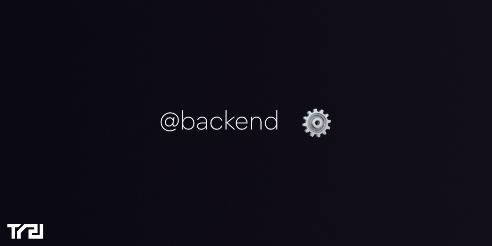

# @backend

  

## Modules

| Name | Description | Git Submodule |
| :---: | :---: | :---: |
| [`@backend/email-templates`](./@backend_email-templates) | Contains all email templates sent to users | No |
| [`@backend/migrations`](./@backend_migrations) | Contains all cassandra and elasticsearch migrations | No |
| [`@backend/nest`](./@backend_nest) | Contains all NestJS code and apps | No |
| [`@backend/simulation`](./@backend_simulation) | Contains simulation scripts | No |
| [`@backend/tasks`](./@backend_tasks) | Contains all gulp tasks related to the backend, and used in @repo | No |

## Tutorials

